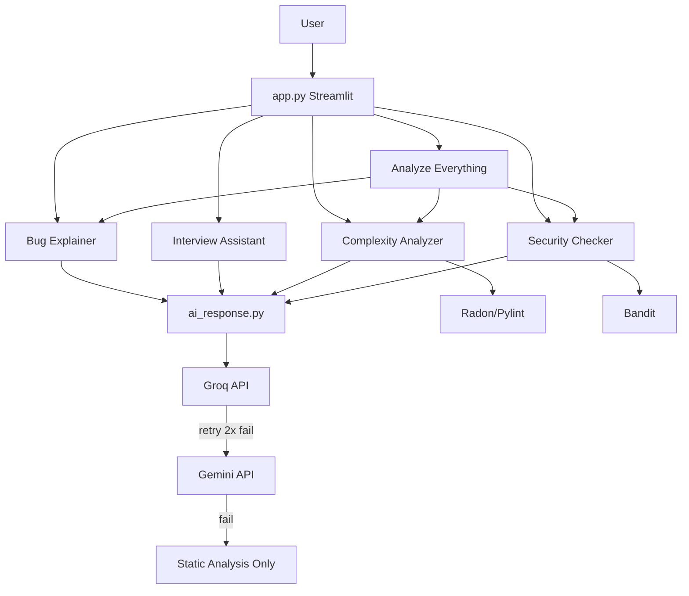
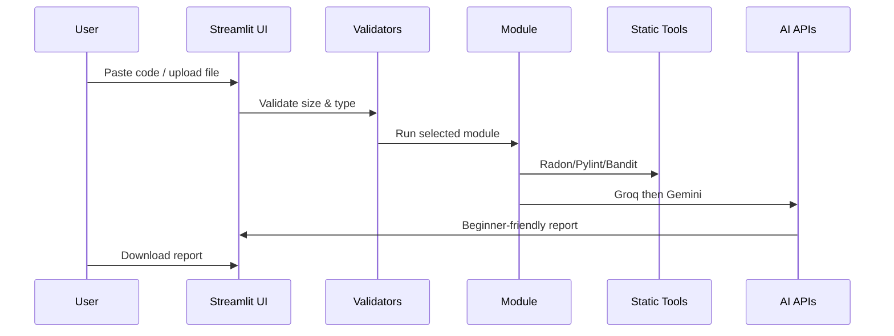

# CodeMentor AI – Smart AI Coding Assistant for Beginners

[](https://streamlit.io)
[](https://python.org)

**CodeMentor AI** is a production-ready Generative AI web application that helps beginner programmers understand errors, practice interviews, analyze code complexity, and write secure code — all in simple English.

---

## Features

| Module | Description |
|--------|-------------|
| **AI Bug Explainer** | Explains errors, why they happened, corrected code, best practices |
| **Interview Assistant** | Text + **Voice Interview Mode** (TTS questions, mic answers, Whisper STT) |
| **Complexity Analyzer** | Radon + Pylint + AI suggestions |
| **Secure Code Checker** | Bandit + pattern rules + AI security mentoring |
| **Analyze Everything** | One combined professional report + download |
| **Multimodal AI** | Images, PDF, DOCX, TXT, audio, video, and code files |

### Supported upload formats

| Type | Formats |
|------|---------|
| Images | `.png`, `.jpg`, `.jpeg` (OCR for error screenshots) |
| Documents | `.pdf`, `.docx`, `.txt` |
| Audio | `.mp3`, `.wav`, `.m4a` (Whisper speech-to-text) |
| Video | `.mp4`, `.mov` (audio + frame OCR) |
| Code | `.py`, `.java`, `.cpp`, `.js`, `.c` |

---

## Project Structure

```
CodeMentor-AI/
├── app.py                      # Main Streamlit app
├── requirements.txt
├── README.md
├── .env.example
├── .gitignore
├── render.yaml
├── .streamlit/config.toml
├── modules/
│   ├── ai_response.py          # Groq → Gemini fallback
│   ├── bug_explainer.py
│   ├── interview_assistant.py
│   ├── voice_interview.py        # Voice interview UI
│   ├── complexity_analyzer.py
│   ├── security_checker.py
│   └── full_analysis.py
├── utils/
│   ├── file_router.py          # Smart file-type routing
│   ├── image_processor.py      # EasyOCR screenshots
│   ├── pdf_processor.py        # PyMuPDF / pdfplumber
│   ├── document_processor.py   # DOCX / TXT
│   ├── audio_processor.py      # Whisper transcription
│   ├── video_processor.py      # moviepy + frame OCR
│   ├── multimodal_ui.py        # Upload + preview UI
│   ├── speech_to_text.py       # Whisper mic transcription
│   ├── text_to_speech.py       # gTTS / pyttsx3 question audio
│   ├── text_extractor.py
│   ├── file_handler.py
│   ├── helper.py
│   ├── prompt_templates.py
│   ├── validators.py
│   └── cache_manager.py
├── assets/
│   ├── logo.png
│   └── style.css
├── reports/analysis_reports/
└── tests/
```

---

## Quick Start

### 1. Clone & install

```bash
git clone <your-repository-url>
cd multimodel_resume_analyser
python -m venv venv
venv\Scripts\activate        # Windows
# source venv/bin/activate   # macOS/Linux
pip install -r requirements.txt
```

### 2. Configure API keys

```bash
copy .env.example .env       # Windows
# cp .env.example .env       # macOS/Linux
```

Edit `.env`:

```env
GROQ_API_KEY=your_groq_key
GEMINI_API_KEY=your_gemini_key
```

- Groq: https://console.groq.com/
- Gemini: https://aistudio.google.com/

> **Note:** The app runs in **static-only mode** without API keys (Radon, Pylint, Bandit still work).

### 3. Run

```bash
python -m streamlit run app.py
```

Open: http://localhost:8501

---

## Example Input & Output

**Input (Bug Explainer):**

```python
print(name)
```

**Error:** `NameError: name 'name' is not defined`

**Output includes:**

- Error explanation
- Corrected code: `name = "John"` then `print(name)`
- Beginner tips and best practices

---

## Gen AI Techniques

| Technique | Where Used |
|-----------|------------|
| Prompt Engineering | `utils/prompt_templates.py` |
| Context-Aware Reasoning | Code + error + language in prompts |
| Natural Language Generation | Groq / Gemini responses |
| Error Interpretation | `bug_explainer.py` |
| AI Recommendations | Interview & optimization sections |
| Rule + LLM Hybrid | Bandit/Radon/Pylint + AI explanations |
| Structured Reasoning | `full_analysis.py` report sections |

---

## Performance Limits

- Max file size: **1 MB** (code, images, PDF, documents)
- Max audio/video: **10 MB**
- Max code length: **50,000 characters**

> **Video note:** Install [FFmpeg](https://ffmpeg.org/) on your system for video audio extraction.

> **Cloud deploy:** Multimodal libraries (Whisper, EasyOCR) are large. First run may be slow; static code analysis still works if ML libs fail.
- Groq timeout: **30s** (2 retries)
- Gemini timeout: **45s**

---

## Architecture Diagram



---

## Workflow



---

## Testing

```bash
python tests/test_bug_explainer.py
python tests/test_security.py
python tests/test_complexity.py
```

---

## Deployment

### Streamlit Community Cloud

1. Push repo to GitHub  
2. Go to https://share.streamlit.io/  
3. New app → select repo → main file: `app.py`  
4. Add secrets: `GROQ_API_KEY`, `GEMINI_API_KEY`  
5. Deploy  

### Render

1. Connect GitHub repo on Render  
2. Use `render.yaml` (included)  
3. Set environment variables `GROQ_API_KEY`, `GEMINI_API_KEY`  
4. Deploy web service  

---

## Privacy

**Uploaded code is not stored permanently.** Analysis runs in your session; optional report files are local under `reports/analysis_reports/`.

---

## Viva Questions & Answers

1. **What is the primary LLM provider?**  
   Groq API with models `llama-3.3-70b-versatile`, `llama3-8b-8192`, `mixtral-8x7b-32768`.

2. **Explain fallback logic.**  
   Try Groq → retry twice on failure → switch to Gemini → if both fail, use static analysis only.

3. **Why use Bandit?**  
   It automatically detects common security issues in Python code.

4. **What is cyclomatic complexity?**  
   A count of independent execution paths; higher complexity means harder testing and maintenance.

5. **Is the project modular?**  
   Yes — each feature is a separate module; shared logic lives in `utils/`.

---

## Future Enhancements

- GitHub repository URL analysis  
- Multi-language static analyzers  
- User accounts & history (with consent)  
- Code plagiarism checker  
- Voice-based explanations  

---

## Presentation Brief (2 minutes)

CodeMentor AI teaches beginners by combining **fast AI explanations** (Groq/Gemini) with **trusted static tools** (Radon, Pylint, Bandit). Students paste code, pick a module, and receive clear reports. The **Analyze Everything** mode produces one downloadable report for assignments and viva. The codebase is modular, commented, and deployment-ready on Streamlit Cloud and Render.

---

## License

Educational / college project use. Add your institution's license as needed.

---

## Author

Built for beginner programmers and college students learning Generative AI application development.
